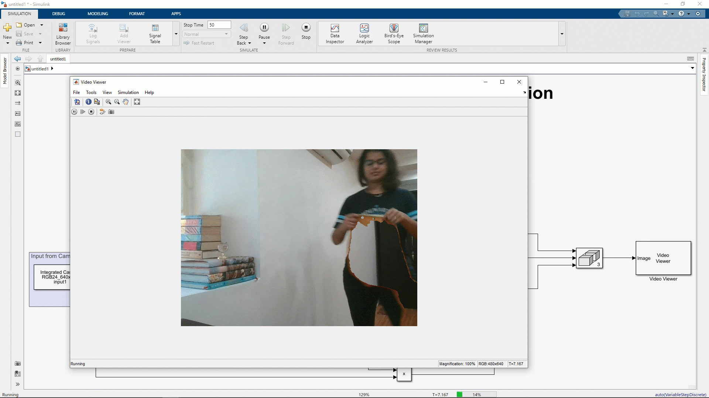
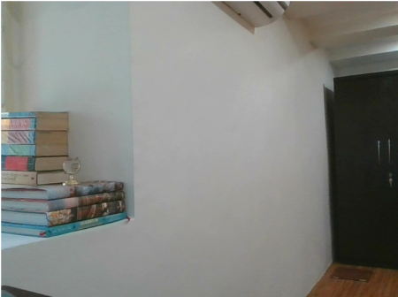

# Invisibility Cloak Using MATLAB:registered: and Simulink:registered: 

This submission contains the implementation of an Invisibility Cloak using image thresholding and segmentation.
The implementation uses [Interactive Apps from the Image Processing ToolboxTM](https://www.mathworks.com/help/images/referencelist.html?type=app&s_tid=CRUX_topnav)

To understand the implementation, watch the video on [Making Vehicles and Robots See: Image Segmentation and Analysis](https://www.youtube.com/watch?v=-bYKl64vpGY) that introduces the concepts of performing image segmentation and analyzing the regions of interest using interactive apps

 

## About the model ##

The model showcases the workflow of using the [Image Thresholder App](https://www.mathworks.com/help/images/ref/colorthresholder-app.html) and the [Image Segmenter App](https://www.mathworks.com/help/images/ref/imagesegmenter-app.html) to create the illusion of an invisibility cloak. 

### Setup ###
#### Background Image ####
- Capture an image of the stationary background from the web camera connected to the system 
- Save the image on the workspace as *backgroundImage*
 

#### Color Thresholding and Segmentation ####
- Capture an image of the colored cloak (cloth) in foreground using a camera connected to the system 
- Open Color Thresholder App and move the sliders to detect the color of the cloak and differentiate it from the background
- Use the MATLAB Functions exported from the mask to create a threshold mask and refine the thresholded mask using Image Segmenter App

#### Algorithm ####
- Multiply the thresholded mask to the background image to display the background in the colored cloak area giving an illusion of invisibility.
- Multiply the binary complement of the mask with the input video to display the video stream for the rest of the image.
- The mask that contains the colored cloak will use the *backgroundImage* and the part of the video that does not have the colored cloak use the original video feed.

## Files ##

**InvisibilityCloak.slx** contains a model which implements the invisibility cloak. Use the MATLAB Function outputs from the Color Thresholder App and the Image Segmenter App in the respective MATLAB Function blocks in the model.

**startScript.mlx** contains the MATLAB code for the initial setup of the model. This has to be used to capture the background image and the color of the foreground cloak.  This is a one-time setup code as long as the placement of the camera, or the background, or the lighting does not change.

*Note:* The *startScript.mlx* file needs to be run if the camera placement is changed. The demonstration needs a stable background without any moving objects in the camera frame except the cloak.

## How to run the model? ##
1. Open the *startScript.mlx* script. 
2. Ensure the correct camera is selected and run the **Camera Setup** section on the script to initiate the camera. 
3. Run the **Background Setup** section of the *startScript.mlx* file. Ensure to have only the stationary background in this image. Do not include yourself or the cloack in this image.
3. Run the **Foreground Setup** section of the *startScript.mlx* file. Use the *foregroundImage* using 'Load Image from the Workspace' in the Color Threshodler App and threshold for the required mask. Export the output as a Function and as Images.
4. Use Image Segmenter App to refine the mask exported from the Color Thresholder App. Export the output as a MATLAB Function.
5. Open the the Simulink model *InvisibilityCloak.slx*. 
6. Replace the contents of the respective MATLAB Functions blocks (i.e. *Color Thresholding* and *Refining Mask*) with the App-generated MATLAB functions.
7. Run the **Clear Variables** section on the *startScript.mlx* script.
7. Run the model.

## Assumptions in the model ##

- The model assumes that the camera is stationary.
- The model assumes that the only object moving in the video frame is the foreground with the invisibility cloak.

## Products Required ##
- MATLAB
- Simulink
- Image Processing Toolbox
- Image Acquisition ToolboxTM 
- Computer Vision ToolboxTM
- [MATLAB Support Package for USB Webcams](https://www.mathworks.com/matlabcentral/fileexchange/45182-matlab-support-package-for-usb-webcams) (Add-On)
- [Image Acquisition Toolbox Support Package for OS Generic Video Interface](https://in.mathworks.com/matlabcentral/fileexchange/45183-image-acquisition-toolbox-support-package-for-os-generic-video-interface) (Add-On)

The license is available in the License file within this repository.

In case of any questions, please reach out to us at roboticsarena@mathworks.com.

Copyright 2021 The MathWorks, Inc.

